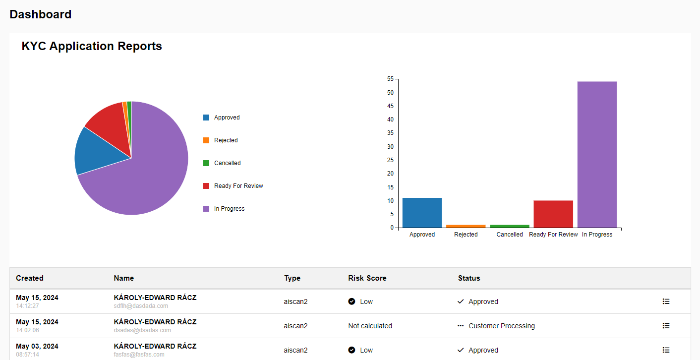

# React KYC Dashboard with Charts

This project is a React application that displays a dashboard inspired by a given design. The dashboard features a table with KYC application reports and two types of charts (Pie Chart and Bar Chart) to visualize the status of the applications.




## Project Structure

- **components/**: Contains the React components for the Dashboard, PieChart, BarChart, and ApplicationTable.
- **hooks/**: Contains the useDataContext custom hook to provide DataContext for managing and providing data to the components.
- **utils/**: Contains constant values used in the project.
- **App.js**: The main component that sets up the layout of the dashboard.
- **App.css**: The main stylesheet for the application.
- **index.js**: The entry point of the React application.

## Features

- **Table**: Displays KYC application reports with attributes such as name, email, type, risk score, and status.
- **Pie Chart**: Visualizes the distribution of application statuses.
- **Bar Chart**: Displays the count of different application statuses.

## Getting Started

### Prerequisites

- Node.js (version 14 or higher recommended)
- npm (version 6 or higher recommended)

### Installation

1. Clone the repository:
   ```sh
   git clone https://github.com/acestar121/react-kyc-dashboard-charts.git
   cd react-kyc-dashboard-charts
   ```
2. Install the dependencies:
   ```sh
   npm install
   ```

### Running the Application

1. Start the development server:
   ```sh
   npm start
   ```

2. Open your browser and navigate to http://localhost:3000 to see the application running.

### Usage

The application displays a table of KYC application reports.
The Pie Chart and Bar Chart visualize the distribution and count of application statuses respectively.

### Available Scripts

In the project directory, you can run:

- `npm start`: Runs the app in the development mode.
- `npm test`: Launches the test runner in the interactive watch mode.
- `npm run build`: Builds the app for production to the build folder.
- `npm run eject`: Removes the single build dependency from your project.

## Contributing

    Contributions are welcome! Please open an issue or submit a pull request for any changes or improvements.

## License

    This project is licensed under the MIT License. See the LICENSE file for details.

## Acknowledgements

    React
    D3.js
    Font Awesome
